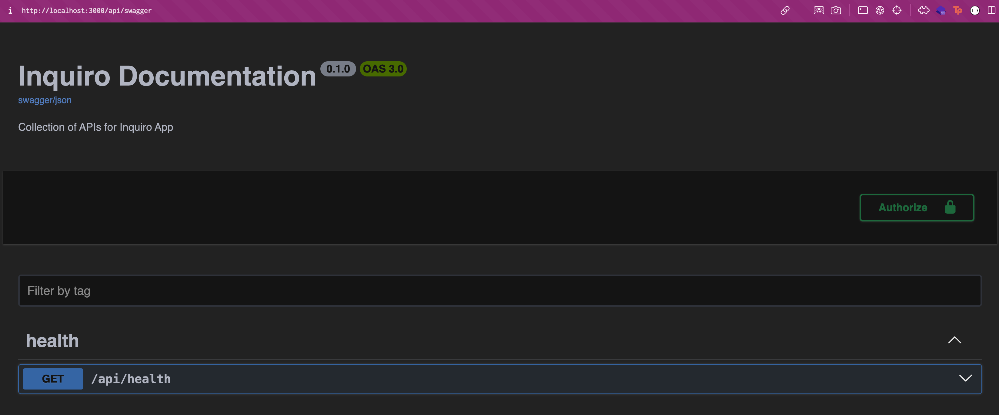
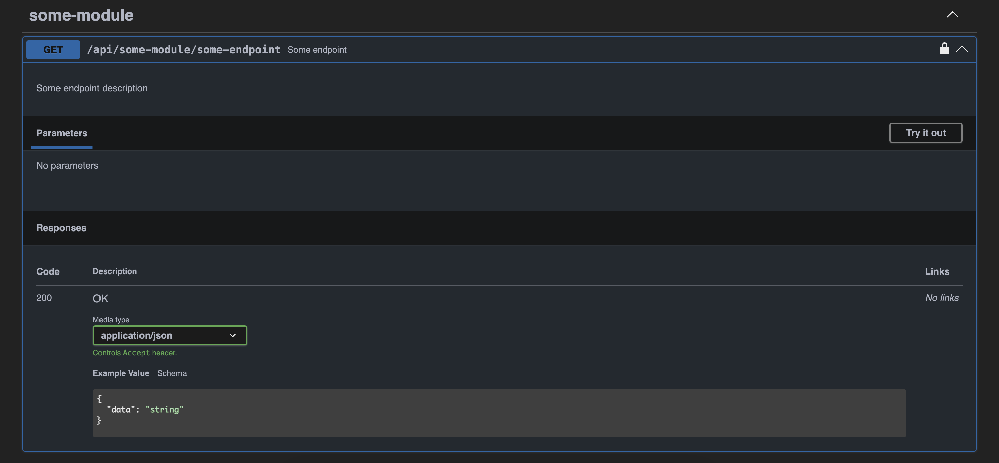

# Backend Server

This project's backend will be utilizing Next.js API handler to create a serverless API. The backend server will be the main orchestrator of the application. It will be responsible for handling all the business logic, data processing, and AI inference.

The backend server's framework of choice is [Elysia.js](https://elysiajs.com/) which is a framework built on [Bun](https://bun.sh). Elysia.js offers a more performant and scalable alternative to Express.js. It also offers a more intuitive and easier to use API. The reason why Elysia.js is chosen is mainly due to development ergonomics and performance. Elysia.js also offers [Eden Treaty](https://elysiajs.com/eden/treaty.html#eden-treaty) which is a type-safe client side library that can be used to communicate with the backend server, allowing for more robust and type-safe communication between the client and the server.

## Backend Project Structure

The backend project structure is as follows:

```
.
├── app
│   ├── api/[...slugs]
│   │   ├── route.ts
├── server
│   ├── configs/
│   ├── decorators/
│   ├── derivers/
│   ├── modules/
│   │   ├── some-module/
│   │   │   ├── index.ts
│   │   │   ├── service.ts
│   ├── index.ts
│   ├── setup.ts
```

### `server/index.ts`

This is the main entry point of the backend server. This file will be responsible for starting the server and setting up the server's configuration.

```ts
// server/index.ts
export const backendApp = intializeBaseBackend()
  .use(publicBackend)
  .use(privateBackend);
```

the `backendApp` variable is the main backend server instance. It is consumed by `app/api/[...slugs]/route.ts` to register the API routes. Elysia will automatically populate the routing based on the `backendApp` instance.

```ts
// app/api/[...slugs]/route.ts
import { backendApp } from "@server/index";

export const GET = backendApp.handle;
export const POST = backendApp.handle;
```

_**tl;dr:**_ `backendApp` is the main backend server instance that is used to register API routes. So any routes that are registered in `backendApp` will be automatically populated in `app/api/[...slugs]/route.ts`.

### `server/modules/`

This folder contains all the modules that are used by the server. Modules determined the business logic and the route handling of the server. Each module will be separated by folder. Each module folder will contain an `index.ts` file and a `service.ts` file. The `index.ts` file will be responsible for registering the routes and filling in metadatas while the `service.ts` file will be responsible for the business logic of the module.

Note that this is a convention that is based off of [Nest.js](https://nestjs.com/) framework. This convention is not enforced by Elysia.js. You can structure your modules however you want. This is just a convention that is used by this project for consistency.

```ts
// server/modules/some-module/index.ts
import { basePrivateBackend } from "@server/setup";
import { someModuleService } from "./service";

export const someModule = basePrivateBackend.group("/some-module", (app) =>
  app.get("/some-endpoint", () => {
    return someModuleService.doSomething();
  }),
);
```

```ts
// server/modules/some-module/service.ts
export const someModuleService = {
  doSomething: () => {
    ...
    return "something";
  },
};
```

This will generate an endpoint on `/api/some-module/some-endpoint` that will return the result of `someModuleService.doSomething()`

### `server/setup.ts`

This file contains the base setup for the backend server. Such as setting up private and public routes for backend. The main difference is that private routes will be protected by clerk's middleware and the route handler will receive clerk's object as a parameter while public routes does not.

```ts
export const publicBackend = new Elysia().get("/health", () => "OK", {
  detail: {
    tags: ["health"],
  },
});

export const basePrivateBackend = new Elysia()
  .decorate(decorators)
  .derive(derivers);
```

The base private backend will be later populated by the modules. The `decorators` and `derivers` are used to pass metadata to each request handler. More on this later.

The modules will be registered in `server/index.ts` file.

```ts
// server/modules/index.ts
export const registerModule = (app: typeof basePrivateBackend) => {
  // Could not iteratively register modules dynamically due to deep resursive type inference
  return app.use(chatModule).use(snippetModule);
};
```

### `server/configs/`

This folder contains all the server configurations. Any static configurations that are needed by the server should be placed here. For example, the `server/configs/swagger.ts` file contains the swagger configuration for the server.

### `server/decorators/`

This folder contains all the decorators that are used by the server. Decorators are used to pass metadata to each request handler. Decorators are only evaluated _**once**_ when the server is started. For example, this project will be using OpenAI for AI inference. So we create an openAI decorator so we can pass openAI object to each request handler.

```ts
// server/decorators/index.ts
import { openAIClient } from "./openai";

export const decorators = {
  openai: openAIClient,
};
```

```ts
// server/modules/some-module.ts
app.get(
    "/some-endpoint",
    ({ params, openai }) => {
        return openai.doSomething();
    },
),
```

Refer to [Elysia.js - Context](https://elysiajs.com/essential/context.html#context) for more information on decorators, derivers, etc.

### `server/derivers/`

Similar to decorators, derivers are used to pass metadata to each request handler. The difference is that derivers are used to pass metadata that is derived from the request. For example, clerk authentication will be evaluated in every request. So we create a clerk deriver to pass the clerk object to each request handler.

```ts
// server/derivers/index.ts
import { clerkContext } from "./clerk";

export const derivers = async () => {
  return {
    clerk: await clerkContext(),
  };
};
```

Refer to [Elysia.js - Context](https://elysiajs.com/essential/context.html#context) for more information on decorators, derivers, etc.

## Documentation



The backend server will be documented using [Swagger UI](https://swagger.io/). The documentation will be automatically generated based on the server's configuration. The documentation will be available on `/api/swagger` endpoint in _**non-production**_ environment. Information on the endpoints will be automatically generated based on the metadata that is passed to the request handler. For example, the following code will generate a swagger documentation that looks like this:

```ts
// server/modules/some-module/index.ts
export const someModule = basePrivateBackend.group("/some-module", (app) =>
  app.get(
    "/some-endpoint",
    () => {
      return "something";
    },
    {
      detail: {
        tags: ["some-module"],
        summary: "Some endpoint",
        description: "Some endpoint description",
        security: [
          {
            bearer: [],
          },
        ],
        responses: {
          200: {
            description: "OK",
            content: {
              "application/json": {
                schema: {
                  type: "object",
                  properties: {
                    data: {
                      type: "string",
                    },
                  },
                },
              },
            },
          },
        },
      },
    },
  ),
);
```



Please refer to [Elysia.js - Swagger Plugin](https://elysiajs.com/plugins/swagger.html#swagger) and [Swagger UI Docs](https://swagger.io/specification/v2/) for more information on how to configure the swagger documentation per request and globally.
